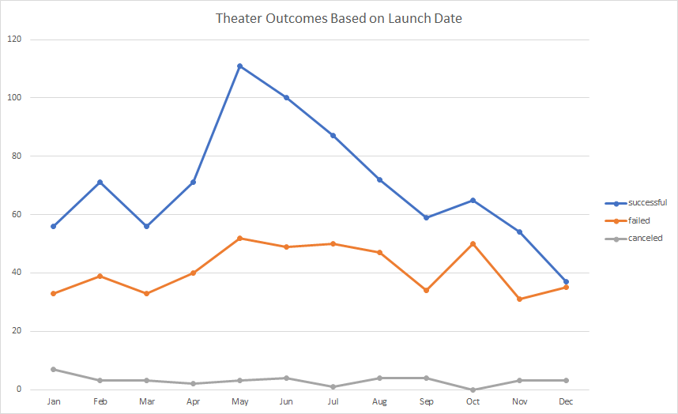
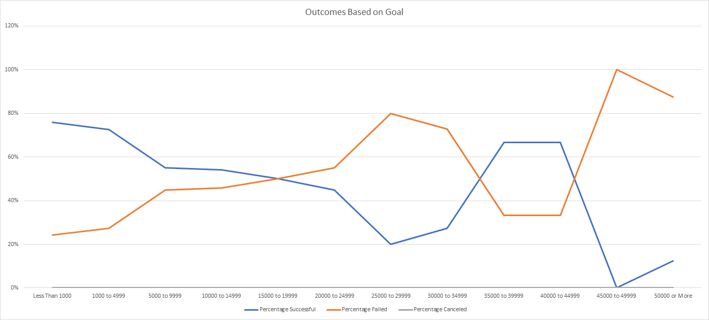

# Kickstarting with Excel

## Overview of Project
I have a new customer, Louise. She is rasing money for her play *Fever* which is now close to its fundraising goal. Louise asked me to brief her on other campaigns' successfulness in relation to their launch dates and funding goals.
### Purpose
The purpose of my analysis is to give Louise the best idea of how successful were other campaigns. My charts and comments must tell her the companies' stories of success or failure depending on their launch dates and funding goals.
## Analysis and Challenges
### Analysis of Outcomes Based on Launch Date
Here is a chart showing company's success and failure counts depending on month on average in 2009-2017. It is based on a pivot table which aggregates data from the Kickstarter dataset.

### Analysis of Outcomes Based on Goals
Here is a chart showing company's success and failure percentages depending on goal amount on average in 2009-2017. It is based on a table made with COUNTIFS() which count events filtering them by goal amount, outcome, and subcategory.

### Challenges and Difficulties Encountered
When I did outcomes-based-on-goals part, I found it challenging to decide on how to use just learnt COUNTIFS() most effectively.

It occurred to me, that if I put "successful", "failed", and "canceled" in B, C, and D columns' headers, and "'1,000", "'5,000", "'10,000", etc. in 2st, 3rd, 4th, etc. rows of column A, I could automatically put all this together into COUNTIFS()' arguments.

But then I thought that if I want COUNTIFS() to be the same along all cells, I'll have to add first and last rows with '0 and something like '1e99 as infinity. Empty rows will look ugly. Another option is to use a shorter versions of COUNTIFS() in the first and last rows, each of which use only one limit to compare with, "less than" and "more than" respectively.

And *then* it occurred to me that I am wasting my and - probably - my instructor's time. That I make things more complicated and potentially buggy. So I followed the instructions.
## Results
- What are two conclusions you can draw about the Outcomes based on Launch Date?
  1. Success and failure counts change simultaneously from month to month, but success line is more volatile.
  2. The sweetest moment for company launch is May, followed by June and July. December is the worst month.
- What can you conclude about the Outcomes based on Goals?
  1. The cheapest - less than $1,000 - companies are the most successful.
  2. Expensive ($25,000 to $29,999) and ridiculously expensive (more than $45,000) companies are failing and spectacularly failing respectively.
  3.  Decently expensive companies ($35,000 to 45,000) are decently successful.
- What are some limitations of this dataset?
  - Amounts are provided in different currencies on different years. It would be great to have all of them in one currency - dollar, for instance - and in today's dollars:
    * to get such data we need to (i) convert every amount to a dollar equivalent at the exchange rate on the record's date, and (ii) convert the results to today's dollar according to inflation rates year on year.
    * such data would give us an idea of (i) how expensive it is to be a part of the industry in different countries, and (ii) how countries' price competitiveness changed through the years.
- What are some other possible tables and/or graphs that we could create?
  - Stacked area plot of Outcomes by Launch Date in percentage - not quantities - of successful, failed and cancelled events. It's going to show how good is a year in terms of success-to-failure ratio more obvious.
  - Box-and-whisker plots of today-dollar Goal and Pledged amounts - by countries on specific year, by years on specific country - all that filtered by event types the user interested in. I mean a pair of boxes - Goal & Pledged of filtered events, side by side - for every year/country. It would enable users to decide on optimal countries for their projects.